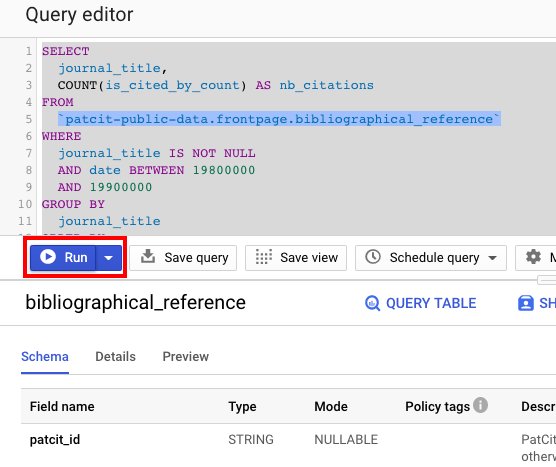
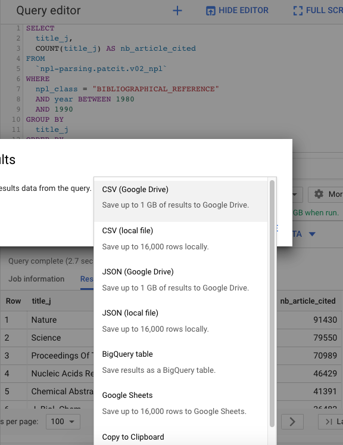

[gs-quickstart]:https://cloud.google.com/storage/docs/quickstarts-console
[zen-patcit]:https://zenodo.org/record/4244176
[^bq-save]:You can save small tables (less than 16,000 rows) to clipboard, locally or to Google sheets. You can save mid-size (less than 1Gb) tables to Google Drive. Larger tables have to be saved to BigQuery, then to Google Cloud Storage and from there you can download them locally.


## Zenodo

The dataset is available on [Zenodo][zen-patcit]!

!!! info "patCit Versioning"
    Versions of the dataset are archived on Zenodo as of `v0.15`.

#### Dataset structure

The patCit dataset has the following structure:

```bash
📁 patcit
├── 📝 README.md
├── 🗃️ frontpage_allmeta.tar
├── 🗃️ frontpage_bibliographicalreference.tar
├── 🗃️ frontpage_database.tar
├── 🗃️ frontpage_normstandard.tar
├── 🗃️ frontpage_wiki.tar
├── 🗃️ intext_bibliographicalreference.tar
└── 🗃️ intext_patent.tar
```

Each `.tar` file contains:

- compressed data file(s) in newline delimited JSON (`.jsonl.gz`) corresponding to the data table itself. When the table is large, it is chunked in multiple files.
- the schema of the data table in JSON (`.json`).

??? tip "Build a table locally"

	It is not possible to detail all the possible procedures due to the large diversity of database services. Instead, below are the general guidelines for any database service.

	1. Download the tar file(s) corresponding to the table(s) you are interested in
	2. Untar the file(s) (e.g. `tar -xvf <your-file.tar>` on mac/linux)
	3. Unzip the data file(s) (e.g. `gunzip *.jsonl.gz` on mac/linux). This step is actually optional since some database services enable table building using zipped data files.
	4. Build the table in your SQL like database service using the specified schema


## BigQuery

In many cases, you don't need the whole dataset for your research. In order to avoid tedious filtering and post-processing on your local machine, we recommend that you adopt the following strategy:

1. Query patCit using the BigQuery public release of the dataset. See our BigQuery [exploration guide](explore.md) if you are new to BigQuery.
2. Save the resulting table[^bq-save]. Here you go!


??? example
    Let's assume that you are interested in the ranking of journals by the number of articles cited by patents and published in the 1980s.

    The related query is the following:

    ```sql
    SELECT
	  journal_title,
	  COUNT(is_cited_by_count) AS nb_citations
	FROM
	  `patcit-public-data.frontpage.bibliographical_reference`
	WHERE
	  journal_title IS NOT NULL
	  AND date BETWEEN 19800000
	  AND 19900000
	GROUP BY
	  journal_title
	ORDER BY
	  nb_citations DESC
    ```

    **Run the query**

    

    **Save the query**

    
