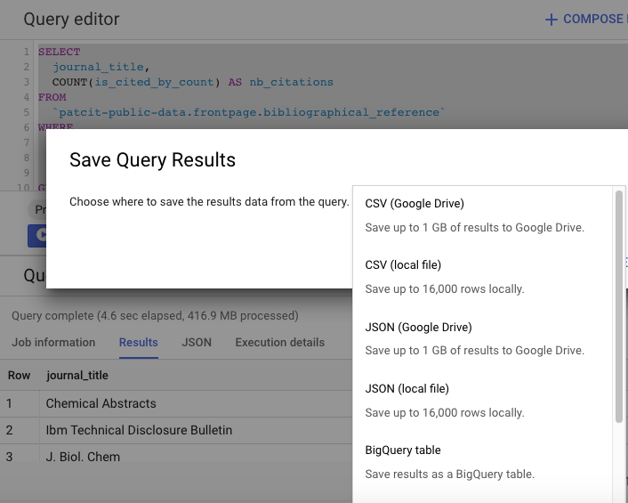

[gs-quickstart]:https://cloud.google.com/storage/docs/quickstarts-console
[gs-patcit]:https://console.cloud.google.com/storage/browser/patcit/
[zen-patcit]:https://zenodo.org/record/3710994#.Xm_uE5NKhEI
[^nest]:E.g. there are many authors with a name, surname, a gender name, etc for a unique publication
[^zen]:Zenodo is a general-purpose open-access repository developed under the European OpenAIRE program and operated by CERN
[^bq-save]:You can save small tables (less than 16,000 rows) to clipboard, locally or to Google sheets. You can save mid-size (less than 1Gb) tables to Google Drive. Larger tables have to be saved to BigQuery, then to Google Cloud Storage and from there you can get them locally.

## Before you start

#### Dataset structure

The PatCit dataset has the following structure:

```bash
📁 patcit
├── 📝 README.md
├── 📁 npl
│   ├── 📁 csv
│   └── 📁 json
└── 📁 intext
    ├── 📁 csv
    └── 📁 json
```

where:

- `npl` refers to the front-page NPL citations data
- `intext` refers to the in-text citations data

#### Data format

Each sub-dataset is available in 2 flavors:

- newline delimited `json` - *recommended*
- `csv`

!!! info "`json` or `csv`?"

    Bibliographical data include fundamentally nested variables[^nest]. That's why we recommend the `json` format. Note also that any modern data management platform supports `json` formats. We provide the schema of the dataset to make sure that you can easily load it in this format.

    We are also aware that some users might be used to `csv` and relational databases. We thus provide the dataset in this flavor although we believe that it implies overhead time-costs.

#### Additional information

Each sub-folder (e.g. `patcit/npl/json`) contains a specific `README*.md` file which will give you additional information on how to load and use it.

## Download from Google Cloud Storage - <small>*recommended*</small>

??? tip "Google Storage Quickstart"
    If you are new to GCP and want to learn the basics of Google Storage (the storage service of GCP), you can take the
    Google Storage [Quickstart][gs-quickstart]. This should not take more than 2 minutes and might help a lot !

This is the best way to experiment a customizable, smooth and resilient download process. We will make sure that the latest version of the dataset is always available on the [gs://patcit][gs-patcit] bucket.


```bash
gsutil  -u <your-billing-project> \ # specify your billing project
-m cp -r gs://patcit/ <your/destination/folder-or-uri>
```

!!! info
    You can download a specific subset of the dataset by specifying the source folder. E.g. `gs://patcit/npl/json` (instead of `gs://patcit`) will get you only the latest version of the `npl` dataset in its json version.

## Download from Zenodo

The dataset can also be downloaded from Zenodo[^zen]. Follow the [link][zen-patcit]!

!!! info "PatCit versioning on Zenodo"
    Older versions of the dataset will be archived on Zenodo as of `v0.15-patcit`.

## Download a query result from BigQuery

In many cases, you don't need the whole dataset for your research. In order to avoid tedious filtering and post-processing on your local machine, we recommend that you adopt the following strategy:

1. Query the `PatCit` dataset using the BigQuery public release of the dataset. See our BigQuery [exploration guide](./explore.md) if you are new to BigQuery.
2. Save the resulting table[^bq-save]. Here you go!


??? example
    Let's assume that you are interested in the ranking of journals by the number of articles cited by patents and published in the 1980s.

    The related query is the following:

    ```sql
    SELECT
      title_j,
      COUNT(title_j) AS nb_article_cited
    FROM
      `npl-parsing.patcit.v02_npl`
    WHERE
      npl_class = "BIBLIOGRAPHICAL_REFERENCE"
      AND year BETWEEN 1980
      AND 1990
    GROUP BY
      title_j
    ORDER BY
      nb_article_cited DESC
    ```

    **Run the query**

    

    **Save the query**

    
