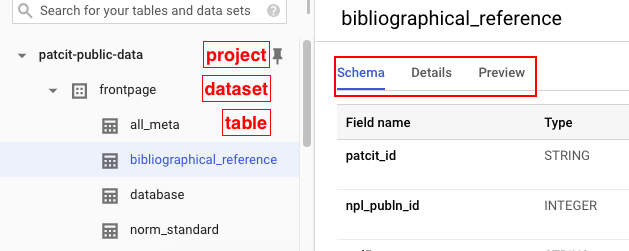
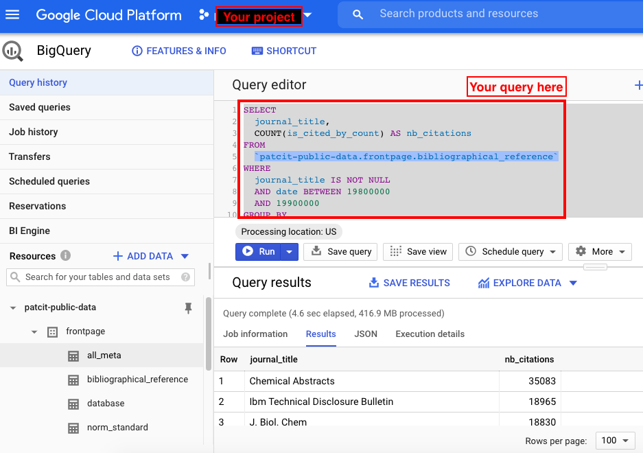

[patcit-data]:https://console.cloud.google.com/bigquery?project=patcit-public-data&p=patcit-public-data&page=project
[v02-npl]:https://console.cloud.google.com/bigquery?project=npl-parsing&p=npl-parsing&d=patcit&t=v02_npl&page=table
[gcp-freetier]:https://cloud.google.com/free/docs/gcp-free-tier
[gbq-quickstart]:https://cloud.google.com/bigquery/docs/quickstarts/quickstart-web-ui

The PatCit dataset is publicly available on Google Cloud BigQuery (GBQ). For those who have a smattering of SQL, we believe that this is the perfect environment to play with the data. Follow the guide!

!!! tip "BigQuery Quickstart"
    If you are new to GCP and want to learn the basics of Google BigQuery (GBQ), you can take the
    GBQ [Quickstart][gbq-quickstart]. This should not take more than 2 minutes and might help a lot !

#### Go to the `patcit-public-data` project on GBQ

Click the [link][patcit-data]

#### Login to your Google Cloud Platform (GCP) account or create one

To access the PatCit dataset, you don't need anything else than a GCP account. In particular, you don't need to enable billing to see the dataset.

!!! tip "Google Cloud Free Tier"
    If you want to run large queries, you might be interested in the [Google Cloud Free Tier][gcp-freetier]. It gives you free resources to learn about Google Cloud services by crediting your account with A 12-month free trial with $300 credit to use with any Google Cloud services.

#### First look at the data

Click any table in the [`patcit`][patcit-data] dataset to have a first look at it.

!!! tip "Table overview with BigQuery"
    Navigate the central pane to learn more on the selected table (schema, details, preview)

    

#### Query the data

You can run SQL queries against any table in the [`patcit`][patcit-data] dataset.

!!! example
    - You need to select a valid project to be able to query a table. Otherwise, you will receive the folowing message `Access Denied: Project patcit-public-data: User does not have bigquery.jobs.create permission in project patcit-public-data`.
    - Use the query editor to specify you query

    

    **Example query**

    ```sql
	SELECT
	  journal_title,
	  COUNT(is_cited_by_count) AS nb_citations
	FROM
	  `patcit-public-data.frontpage.bibliographical_reference`
	WHERE
	  journal_title IS NOT NULL
	  AND date BETWEEN 19800000
	  AND 19900000
	GROUP BY
	  journal_title
	ORDER BY
	  nb_citations DESC
    ```
