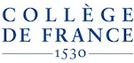

[cverluise-web]:https://cverluise.github.io/
[gderasse-web]:https://gder.phpnet.org/rassenfosse/bio.html
[cverluise]:https://github.com/cverluise
[gderasse]:https://github.com/gderasse
[innov-lab]:https://www.college-de-france.fr/site/philippe-aghion/index.htm
[iipp]:https://www.epfl.ch/labs/iipp/
[credit-web]:https://casrai.org/credit/

# Team

## Initiators

- [Gaétan de Rassenfosse][gderasse-web] ([@gderasse][gderasse]) is Assistant Professor Tenure Track in Science & Technology Policy at EPFL (Lausanne, Switzerland). The overarching objective of his research is to provide the policy environment that best addresses the needs of the knowledge economy.
- [Cyril Verluise][cverluise-web] ([@cverluise][cverluise]) is a PhD Candidate at the Paris School of Economics and an Affiliate at Collège de France (Paris, France). His work is an "attempt to unpack the Innovation black box using data science, one commit at a time". He is a fierce advocate and a modest contributor of open source.

## CRediT

Role | Contributor(s)
---|---
Conceptualization| Gaétan de Rassenfosse, Cyril Verluise
Data curation|  Cyril Verluise
Formal Analysis| Lucas Violon[frontpage-npl], Cyril Verluise, Lucas Violon[intext-bibref]
Funding acquisition| Gaétan de Rassenfosse, Cyril Verluise
Investigation| Cyril Verluise
Methodology| Gaétan de Rassenfosse, Cyril Verluise, Tim Simcoe[norms-standards]
Project administration| Gaétan de Rassenfosse, Cyril Verluise
Resources| EPFL, Collège de France
Software| Cyril Verluise
Supervision| Gaétan de Rassenfosse, Cyril Verluise
Validation|Gaétan de Rassenfosse[intext-patent],Gabriele Cristelli[intext-patent], Francesco Gerotto[matching-doi,parsing-bibref], Kyle Higham[intext-patent], Cyril Verluise, Lucas Violon[intext-bibref]
Visualization| Cyril Verluise, Lucas Violon[intext-bibref]
Writing – original draft| -
Writing – review & editing| -

Roles definition at [CRediT webpage][credit-web].

??? info "Contributors personnal details"

	Contributor | Affiliation2 | GitHub account | More
	---|---|---|---
	Gabriele Cristelli|EPFL|gabricrs|[Google Scholar](https://scholar.google.com/citations?user=yp8qc9UAAAAJ&hl=en)
	Gaétan de Rassenfosse|EPFL|gderasse|[Academic Website](https://gder.phpnet.org/rassenfosse/bio.html)
	Kyle Higham|Hitotsubashi University|kylehigham|[Google Scholar](https://scholar.google.com/citations?user=Ze-7kTYAAAAJ&hl=en)
	Francesco Gerotto|Collège de France|FGer8| -
	Tim Simcoe|Boston University|-|[Academic Website](http://people.bu.edu/tsimcoe/)
	Cyril Verluise|Collège de France|cverluise|[Academic Website](https://cverluise.github.io/)
	Lucas Violon|HEC Paris|lucas-violon| -

## Thanks

We are also thankful to:

- Domenico Golzio for his constant support
- [@wetherbeei](https://github.com/wetherbeei), [@kermitt2](https://github.com/kermitt2), [@SuperMayo](https://github.com/SuperMayo) and [@leflix311](https://github.com/leflix311) for helpful comments
- The many people who help us shape this project through useful comments shared by emails, twitter and direct interactions

## Resources

Resources needed for this project are kindly provided by the [Chair of Innovation and IP Policy][iipp] at EPFL and the [Chair of Economics of Institutions, Innovation and Growth at Collège de France][innov-lab].

{: align=left }
{: align=right }
