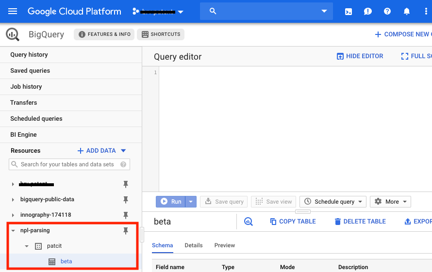
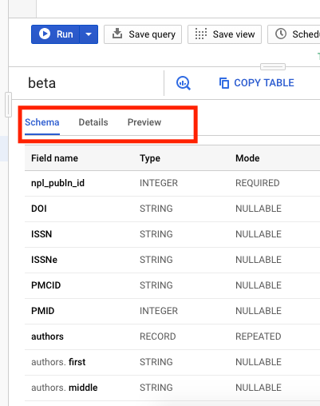
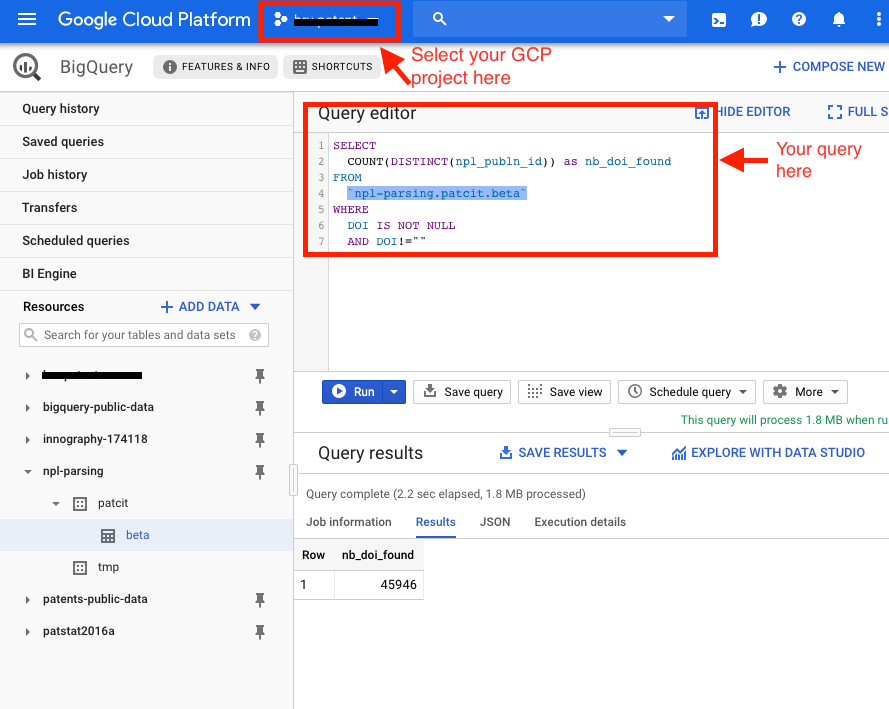

# User Guide

> [Online BigQuery Quickstart](https://cloud.google.com/bigquery/docs/quickstarts)

## Short tutorial

1. Click the link https://console.cloud.google.com/bigquery?project=brv-patent&p=npl-parsing&d=patcit&t=beta&page=table
2. Login to your GCP account

	> Create an account if needed
	>
	> **Note**: you don't need to enable billing to see the dataset
3. Select the `npl-parsing:patcit.beta` table

4. Explore the table:
	- Schema
	- Details
	- preview

6. Query the table

	> **Note**: You need to select a valid project to be able to query `npl-parsing:patcit.beta`. Otherwise, you will receive the folowing message `Access Denied: Project npl-parsing: User does not have bigquery.jobs.create permission in project npl-parsing.`

Nb: seems that we matched a DOI for ~46% (45946/99998) of npl citations in the beta database. Not too bad isn't it?
